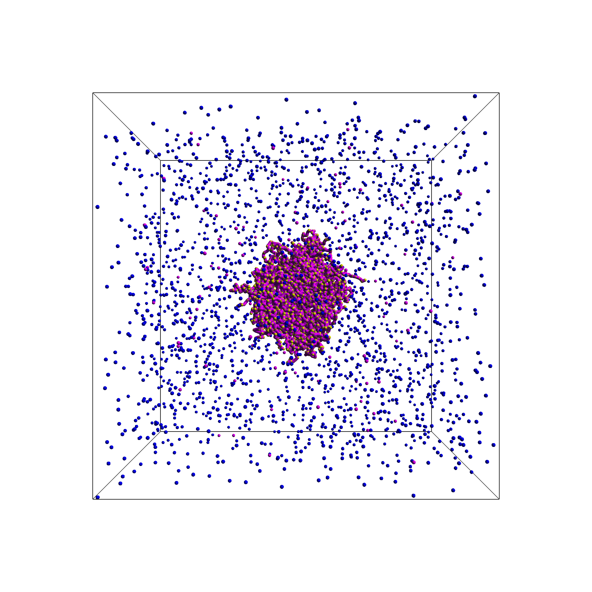
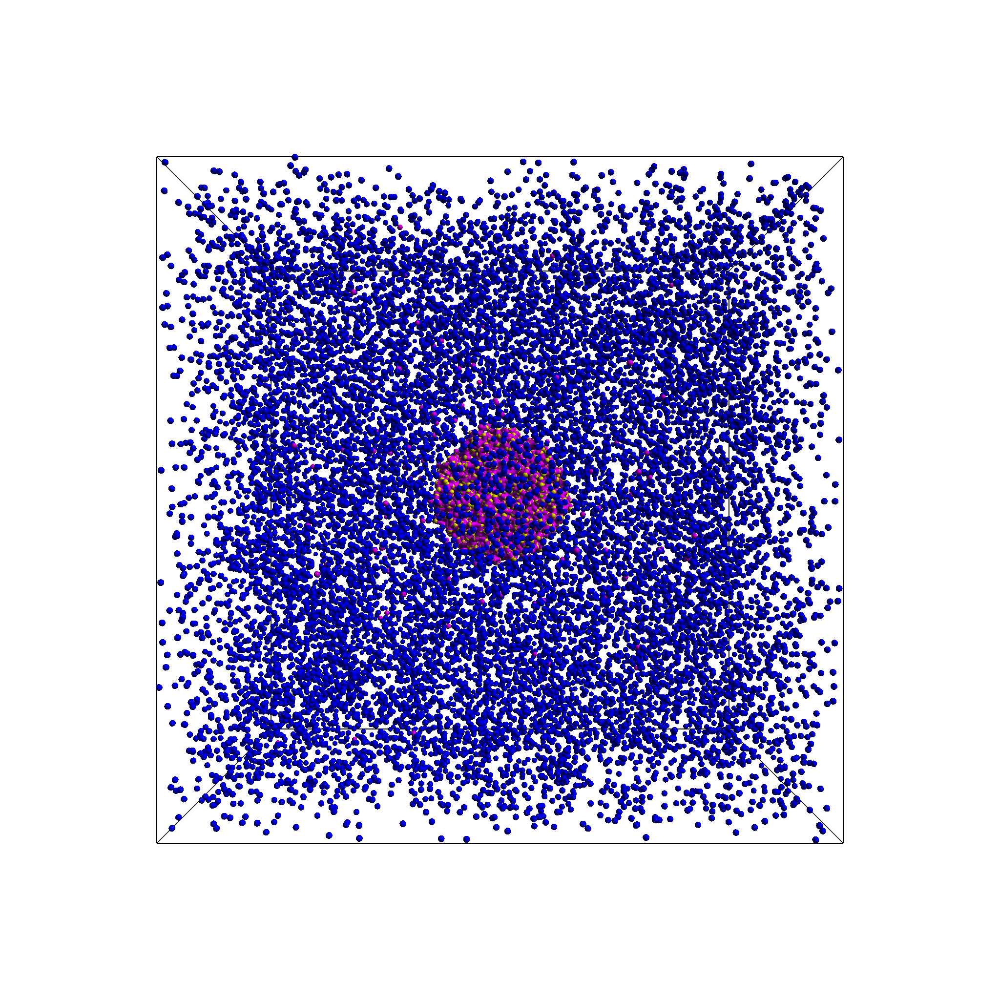
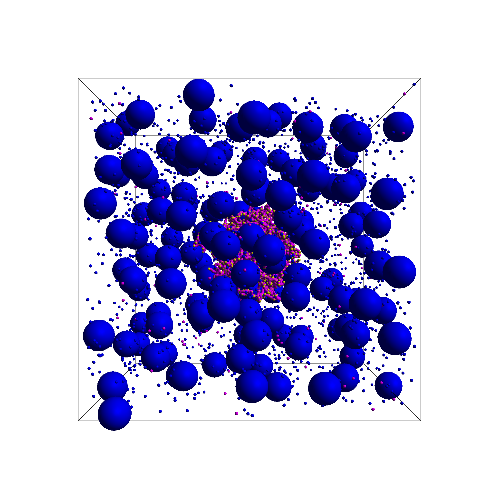
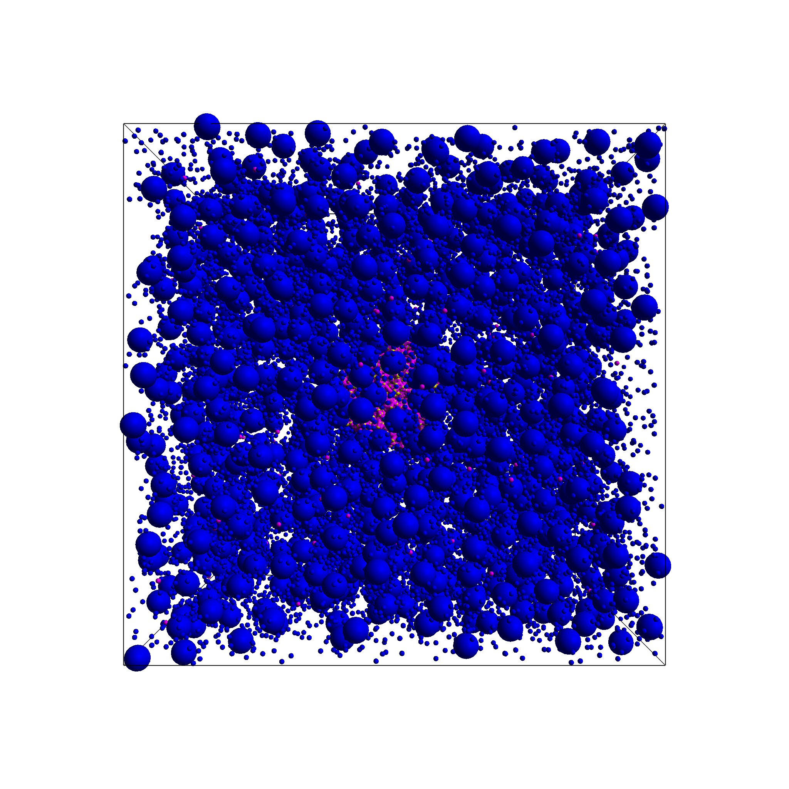

# Magnetic Microgel Simulations with ESPResSo

This repository contains a simulation and analysis pipeline for studying the formation and properties of magnetic microgels (mmgels) using the ESPResSo molecular dynamics package. The project covers the entire workflow from the initial polymer melt to a crosslinked gel, followed by the insertion and equilibration of magnetic nanoparticles (MNPs).

The accompanying analysis scripts, provided as Jupyter Notebooks, allow for in-depth investigation of the microgels' structural properties, including network topology, particle distributions, pore sizes, and overall dimensions under various physical conditions.

## Simulation Visualizations

The simulation pipeline progresses through several distinct stages. Below are snapshots illustrating the gel structure before (Stage 4) and after (Stage 6) the introduction of magnetic nanoparticles, at two different particle densities.

| | Standard Density | Higher Density |
| :---: | :---: | :---: |
| **Stage 4: Gel** |  |  |
| **Stage 6: Magnetic Microgel** |  |  |

*(In Stage 6, the large spheres represent the magnetic nanoparticles embedded within the polymer network.)*

## Getting Started

### 1. Environment Setup

#### Compiling ESPResSo
This project requires building ESPResSo with a custom configuration to maximize performance. Use the `myconfig.hpp` file provided in the `./configs` directory when you compile ESPResSo. This ensures only the necessary features for the simulation are enabled.

#### Python Dependencies
The simulation runner and analysis scripts use several Python libraries. Install them into the virtual environment that your `pypresso` uses:

```bash
pypresso -m pip install -r requirements.txt
```

### 2. Using Pre-computed Data
Existing raw simulation data is provided by the `data.zip` file. Unzip it into the correct directory structure:
```bash
unzip data.zip 
# This should create a folder ./data with the gel directories
```

### 3. Running a Simulation

Simulations are launched using the `pypresso` Python interface for ESPResSo.

#### Basic Command
```bash
pypresso ./src/main.py <output_directory> [options]
```
- `<output_directory>`: The path where all simulation data, configurations, and checkpoints for a single gel simulation will be stored.

#### Example
The following command creates a new simulation directory and runs the process with specific parameters:
```bash
pypresso ./src/main.py ./data/gel_dirs/my_simulation \
    --n_chains 400 \
    --chain_length 80 \
    --steps_melt_eq_max 1000000 \
    --initial_diff_steps 100000
```

**Key Arguments:**
- `--n_chains`: Number of polymer chains.
- `--chain_length`: Number of beads per polymer chain.
- `--steps_melt_eq_max`: Number of timesteps for the initial polymer melt equilibration.
- `--initial_diff_steps`: Number of timesteps for crosslinking agents to diffuse before crosslinking begins.

#### Debugging Tip
To simplify debugging, you can use harmonic bonds for both polymers and crosslinks, which prevents bonds from breaking. This can be enabled with the `--bond_type harmonic` flag.

#### Generating Commands for Parameter Sweeps
To run a large number of simulations with varying parameters, you can use the `create_all_gel_simulation_commands.ipynb` notebook. This notebook prints all the `pypresso` commands needed for a full parameter sweep, which can then be executed in parallel (e.g., using `gnu parallel`).

## The Simulation Pipeline

The creation of a magnetic microgel is a multi-stage process. Each stage represents a distinct physical transformation and is saved as a checkpoint.

1.  **Polymer Melt Creation**: The simulation starts with disconnected polymer strands randomly distributed within a spherical confinement (the "melt").
2.  **Melt Equilibration**: The polymer melt is equilibrated under NVT conditions to reach a stable configuration.
3.  **Crosslinking**: Crosslinking agents are introduced to form covalent bonds between polymer chains, creating a single, interconnected network.
4.  **Gel Equilibration**: The newly formed "gel" is equilibrated. The spherical confinement is removed at the start of this stage, allowing the polymer network to relax into its final structure.
5.  **Nanoparticle Insertion**: Magnetic nanoparticles (MNPs) are inserted into the simulation box containing the equilibrated gel.
6.  **MMGel Equilibration**: The system is equilibrated one final time, allowing the MNPs to disperse within the gel matrix and form the final "magnetic microgel" (mmgel).

## Terminology

-   **Melt / Polymer Melt**: Disconnected polymer strands (Stage 1-2).
-   **Gel**: Crosslinked polymer strands (Stage 4).
-   **MNP**: Magnetic Nanoparticles.
-   **MMGel**: Magnetic Microgel; a gel with embedded MNPs (Stage 6).
-   **CoM**: Center of Mass.

## Analysis

This repository includes a rich set of Jupyter notebooks for analyzing simulation data, located in `src/notebooks/`.

| Notebook | Description |
| :--- | :--- |
| **`analyze_particle_distributions.ipynb`** | Plots 2D projections and radial number densities for all particle types (beads, MNPs) to visualize their spatial distribution. |
| **`analyze_bead_distributions.ipynb`** | Focuses on bead distribution, analyzing how different force fields and phases affect the gel's density profile. |
| **`analyze_crosslinking.ipynb`** | Quantifies network topology by analyzing crosslink counts, beads between crosslinks, and pore size distributions. |
| **`analyze_instant_crosslinking.ipynb`** | Investigates an alternative "instant crosslinking" algorithm and its effect on the final gel structure. |
| **`analyze_mnp_loading.ipynb`** | Analyzes the time evolution of MNP distribution, classifying MNPs by location (inside, surface, outside). |
| **`analyze_sizes.ipynb`** | Calculates the hydrodynamic radius of gels over time to determine if they have reached an equilibrated size. |
| **`analyze_pores.ipynb`** | Uses a probe-particle method to measure the effective pore sizes and their spatial distribution. |
| **`check_simulation_progress.ipynb`** | Provides tools to monitor ongoing simulations, identify completed runs, and compare methods for estimating gel volume. |
| **`plot_gel.ipynb` / `plot_mmgel.ipynb`** | Simple visualization scripts to plot 2D projections of a single gel or mmgel. |
| **`hyperplane_volume.ipynb`** | Explores a novel hyperplane-based method for estimating the volume of the point cloud representing the microgel. |

## Performance and Future Work

### Performance Metrics
Performance was measured on the "helix" cluster for a typical simulation (400 chains of 80 beads, leading to a gel diameter of ~100 σ with ~90 MNPs):

-   **8 cores**: ~4 timesteps per second
-   **64 cores**: ~22 timesteps per second

A full simulation with 2x10⁷ timesteps on 64 cores took approximately **240 hours**. The current performance is a key bottleneck hindering large-scale parameter sweeps.

### Potential Optimizations & Future Work
The following are potential areas for improving simulation performance:

-   **ScaFaCoS Integration**: The `CI` directory of ESPResSo 4.3 contains scripts for compiling ESPResSo with ScaFaCoS. This could provide an alternative to P3M for long-range electrostatic calculations, potentially improving performance. Tests for electrostatics with open boundary conditions would need to be developed and validated against P3M results.

-   **Alternative Electrostatic Solvers**: Investigate using P2NFFT with open boundary conditions as an alternative to the Fast Multipole Method (FMM), which could allow for a smaller simulation box.

-   **Fast-Multipole Proxy Model**: A simplified "proxy model" with only charged particles (no bonded or WCA interactions) was developed to benchmark potential performance. On a single core, it ran approximately twice as fast as the full ESPResSo simulation, indicating significant room for optimization. The script used for that is `scripts/proxy_simulation/a.py`
